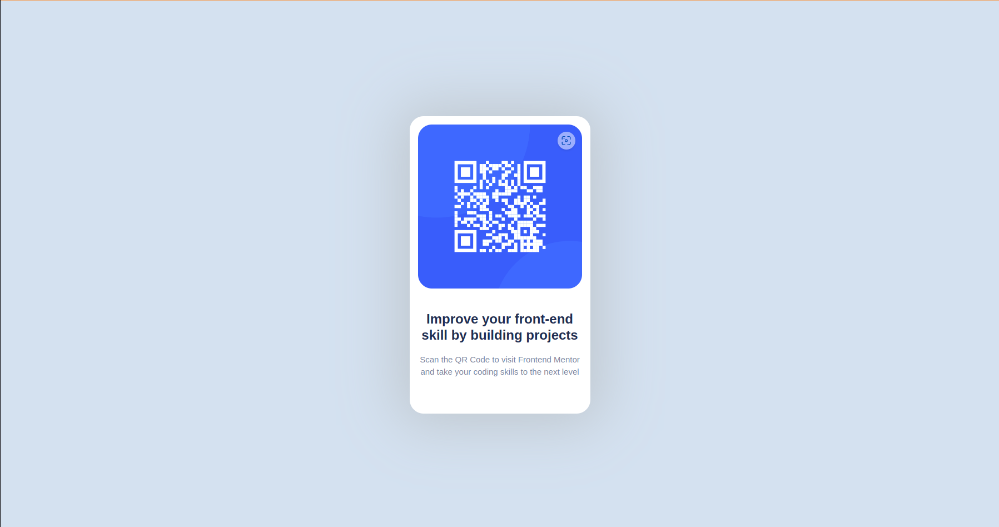

# Frontend Mentor - QR code component solution

This is a solution to the [QR code component challenge on Frontend Mentor](https://www.frontendmentor.io/challenges/qr-code-component-iux_sIO_H). Frontend Mentor challenges help you improve your coding skills by building realistic projects. 

## Table of contents

- [Overview](#overview)
  - [Screenshot](#screenshot)
  - [Links](#links)
- [My process](#my-process)
  - [Built with](#built-with)
- [Author](#author)


## Overview
This is a QR Code Component 
### Screenshot




### Links

- Solution URL: [solution URL here](https://github.com/iamkishoremahto/gr_code_component)
- Live Site URL: [live site URL here](https://iamkishoremahto.github.io/gr_code_component/)

## My process

### Built with

- Semantic HTML5 markup
- CSS custom properties
- Flexbox
- Mobile-first workflow


To see how you can add code snippets, see below:

```html
<!DOCTYPE html>
<html lang="en">
<head>
    <meta charset="UTF-8">
    <meta http-equiv="X-UA-Compatible" content="IE=edge">
    <meta name="viewport" content="width=device-width, initial-scale=1.0">
    <title>QR Code Component</title>

    <link href="https://cdn.jsdelivr.net/npm/bootstrap@5.3.2/dist/css/bootstrap.min.css" rel="stylesheet" integrity="sha384-T3c6CoIi6uLrA9TneNEoa7RxnatzjcDSCmG1MXxSR1GAsXEV/Dwwykc2MPK8M2HN" crossorigin="anonymous">
    <link rel="stylesheet" href="style.css">
</head>
<body>
    <div class="container-fluid d-flex align-items-center justify-content-center main_wrapper">
        <div class="row d-flex align-items-center justify-content-center">
            <div class="col-md-4 d-flex align-items-start  qr_code_wrapper">
                <div class="row d-flex align-items-center justify-content-center qr_code_section">
                    <div class="col-md-12 qr_code">
                        
                    </div>
                    <div class="col-md-12 qr_info">
                        <h4>Improve your front-end skill by building projects</h4>
                        <p>Scan the QR Code to visit  Frontend Mentor and take your coding skills to the next level</p>
                    </div>
                </div>
            </div>
        </div>
    </div>
    
    <script src="https://cdn.jsdelivr.net/npm/bootstrap@5.3.2/dist/js/bootstrap.bundle.min.js" integrity="sha384-C6RzsynM9kWDrMNeT87bh95OGNyZPhcTNXj1NW7RuBCsyN/o0jlpcV8Qyq46cDfL" crossorigin="anonymous"></script>
</body>
</html>
```
```css
:root {
    --White: hsl(0, 0%, 100%);
    --LightGray: hsl(212, 45%, 89%);
    --GrayishBlue: hsl(220, 15%, 55%);
    --DarkBlue: hsl(218, 44%, 22%);
    --LightGray2:rgb(192, 199, 206);
    
}
@import url('https://fonts.googleapis.com/css2?family=Black+Ops+One&family=Nunito&family=Outfit:wght@100;200;300;400;500;600;700;800;900&family=Poppins:ital,wght@0,100;0,200;0,300;0,400;0,500;0,600;0,700;0,800;0,900;1,100;1,200;1,300;1,400;1,500;1,600;1,700;1,800;1,900&family=Ubuntu:ital,wght@0,300;0,400;0,500;0,700;1,300;1,400;1,500;1,700&family=Urbanist:ital,wght@0,100;0,200;0,300;0,400;0,500;0,600;0,700;0,800;0,900;1,100;1,200;1,300;1,400;1,500;1,600;1,700;1,800;1,900&display=swap');

*{

    font-family: 'Outfit', sans-serif;
}

.main_wrapper{
    background-color: var(--LightGray);
    height:100vh;
    padding: 50px;
}

.qr_code_wrapper{
    background-color: var(--White);
    padding: 15px;
    border-radius: 25px;
    min-width: 325px;
    min-height: 500px;
    box-shadow: var(--LightGray2) 0px 0px 100px 20px;
    
    
}

.qr_code_section{
    flex-direction: column;
    gap: 10px;
    

    
}
.qr_code_section div{
    text-align: center;
}

.qr_code_section div img{
    border-radius: 25px;
}

.qr_code_section div h4{
    color: var(--DarkBlue);
    font-weight: 700;
}

.qr_code_section div p{
    color:var(--GrayishBlue);
    font-size: 15px;
    font-weight: 400;
}

.qr_info{
    display: flex;
    align-items: center;
    justify-content: center;
    flex-direction: column;
    gap: 10px;
    height: 200px;
}
```


## Author

- Website - [Kishore Kumar Mahto](https://github.com/iamkishoremahto)
- Frontend Mentor - [@iamkishoremahto](https://www.frontendmentor.io/profile/iamkishoremahto)
